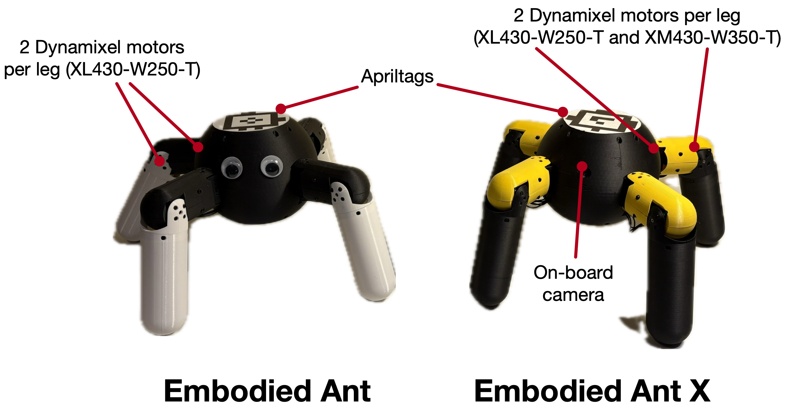

# Embodied MuJoCo Ant

<!--  -->

<p align="center">
  
</p>
<p align="center">
  Video of a learned behaviour directly on hardware.
</p>


## Hardware

The hardware is designed to be easy to build and use:
- single computer operation via USB, python only, minimal dependencies (no embedded firmware / OS, networking, ROS...)
- no battery: continuous operation with wall adapter
- all COTS parts + 3D printed parts
- no soldering required
- no special tools required (only the standard hex drivers for M2, M2.5, and M3 screws which are 1.5mm, 2.0mm, and 2.5mm, respectively)

### Specs

- hip range +/- 45deg
- knee range +/- 70deg


### Bill of Materials

<p align="center">
  
</p>

Top camera: [Logitech Brio 101](https://www.logitech.com/en-us/shop/p/brio-100-webcam) for tracking.

#### Embodied Ant X

| Part Name                                 | Quantity | Notes                                                                                                       | Link                                                                                               | Price (Nov 2025)     |
|-------------------------------------------|----------|-------------------------------------------------------------------------------------------------------------|----------------------------------------------------------------------------------------------------|----------------------|
| Dynamixel XM430-W350-T                    | 4        | Main actuators  (incl.  180mm cable)                                                                        | [Robotis](https://www.robotis.us/dynamixel-xm430-w350-t/)                                          | $1241.56 (310.39 each) |
| Dynamixel XL430-W250-T                    | 4        | Main actuators  (incl.  180mm cable)                                                                        | [Robotis](https://www.robotis.us/dynamixel-xl430-w250-t/)                                          | $110 (27.50 each)    |
| HN11-I101 Set                             | 4        | Idler bearing                                                                                               | [Robotis](https://www.robotis.us/hn11-i101-set/)                                                   | $32.20 (8.05 each)   |
| HN12-I101 Set                             | 4        | Idler bearing                                                                                               | [Robotis](https://www.robotis.us/hn12-i101-set/)                                                   | $81.88 (20.47 each)  |
| U2D2 Starter Set                          | 1        | Includes: USB to Dynamixel, Power Hub Board, 12V 5A Power Suppy                                             | [Robotis](https://www.robotis.us/dynamixel-starter-set-us/)                                        | $68.66               |
| Kakute H7 Mini / TBS Lucid Freestyle mini | 1        | Quadcopter flight controller used as IMU (Any Betaflight compatible autopilot with 20x20mm mouts will work) | [getfpv](https://www.getfpv.com/tbs-lucid-freestyle-f4-mini-flight-controller-icm42688-20x20.html) | $51.99               |
| Cable Matters Ultra Mini USB Hub          | 1        | 4 Port USB Hub                                                                                              | [Amazon](https://www.amazon.com/dp/B00PHPWLPA/)                                                    | $15.49               |
| Short USB-A to USB-C Cable                | 1        | For autopilot (IMU)                                                                                         | [Amazon](https://www.amazon.com/dp/B01ASXBY62)                                                     | $9.49                |
| Short USB-A to micro-USB cable            | 1        | For Dynamixel U2D2                                                                                          | [Amazon](https://www.amazon.com/dp/B08BZD66H4?th=1)                                                | $6.99                |
| USB-A extension cable                     | 1        | As tether for the robot                                                                                     | [Amazon](https://www.amazon.com/dp/B07ZV6FHWF/)                                                    | $5.99                |
| Screw M2x3mm with socket head             | 32       | Output shaft, 8 per motor                                                                                   | [McMaster](https://www.mcmaster.com/91290a010/)                                                    | $15.62 (pack of 50)  |
| Screw M2x4mm with socket head             | 48       | Output shaft, 8 per motor, 3D print assembly                                                                | [McMaster](https://www.mcmaster.com/91290A012/)                                                    | $18.48 (pack of 100) |
| Screw M2.5x16mm with socket head          | 32       | motor mount, 4 per motor                                                                                    | [McMaster](https://www.mcmaster.com/91290a106/)                                                    | $12.81 (pack of 50)  |
| Screw M3x8mm with socket head             | 6        | U2D2 power board mount + IMU                                                                                | [McMaster](https://www.mcmaster.com/91290A113/)                                                    | $12.82 (pack of 100) |
| Nut M2                                    | 16       | 3D print assembly 5 per leg                                                                                 | [McMaster](https://www.mcmaster.com/91828A111/)                                                    | $6.14 (pack of 100)  |
| Nut M3                                    | 2        | U2D2 power board mount                                                                                      | [McMaster](https://www.mcmaster.com/91828A211/)                                                    | $4.73 (pack of 100)  |
| On-board camera                           | 1        | Logitech Brio 101                                                                                           | [Logitech](https://www.logitech.com/en-us/shop/p/brio-100-webcam)                                                       | $29.99               |
| 3D Printed Parts                          | -        | STL files in `hardware/rev3`. Print all `leg` files 4x, others 1x.                                          | -                                                                                                  | -                    |
| **Total**                                 |          |                                                                                                             |                                                                                                    | **$1724.84**         |

We recommend adding a heat sink to the knee actuators, for example this [one](https://www.amazon.com/dp/B08HLZWKYN?ref_=ppx_hzsearch_conn_dt_b_fed_asin_title_1&th=1)


### Dynamixel Setup (before assembling the robot!)

The Dynamixels should be configured to 1Mbaud and have their IDs changed to the following:

| Motor Position      | Motor ID |
|---------------------|----------|
| Rear Right Hip      |   10     |
| Rear Right Knee     |   11     |
| Front Right Hip     |   20     |
| Front Right Knee    |   21     |
| Front Left Hip      |   30     |
| Front Left Knee     |   31     |
| Rear Left Hip       |   40     |
| Rear Left Knee      |   41     |

Use the following script to change the IDs of the motors, connecting one at a time.
```
python3 embodied_ant_env/dynamixel_change_id.py /dev/tty.usbserial-XXXXXXX <NEW_ID> 57600
```

When done, the following command will change the baudrate of all connected motors on the port to 1Mbaud.
```
python3 embodied_ant_env/dynamixel_change_baud.py /dev/tty.usbserial-XXXXXXX 1000000
```

## Software Setup

Create a virtual environment and install the dependencies. (python >= 3.10)
```
python3.12 -m venv ant_env
source ant_env/bin/activate
pip install -r requirements.txt
```

To create a new config file, run:
```
python3 embodied_ant_env/make_ant_config.py /dev/tty.usbserial-XXXXXXX <APRIL_TAG_ID>
```
which will create a new config file `ant<APRIL_TAG_ID>.json` in the current directory.

Next, edit the config file to specify imu port, camera id and fov.

### Misc

if git push fails when adding large (~10MB) commits, try:
```
git config --global http.postBuffer 1048576000
```

### Possible signals

- Joint position
- Joint velocity
- Body angular rate
- Inertial up in body
- Commanded velocity in x and y

For reward: position of the body in x and y, and the angle of the body.


## Run the simulation

```
cd sim
python3 ant_mujoco.py
```

## Run SAC

for simulation:
```
cd agents/sac/
./run.sh sim
```

for hardware:
```
cd agents/sac/
./run.sh hw
```

## Frequently Asked Questions (FAQ)

### Q: The position of the ant flickers. What should I do?

The ArUco system is designed to be quite robust. If you encounter problems, make sure the markers are clearly visible and the camera exposure is configured properly (you can adjust exposure using LogiTune). 
Here are some suggestions:
* Depending on your environment, you may need to disable auto-exposure for more consistent detection.
* For the best performance, you should have the camera looking down at the playground.
* The origin marker should be mounted flat. Any warping can cause issues.
* Make sure to plot all system inputs and outputs to verify that the signals are clean. Learning from noisy or faulty signals can lead to poor results.

### Q: What’s the recommended way to specify a /dev/ device path in a JSON file on Ubuntu?

Use the persistent device path, for example:
```
/dev/serial/by-id/YYY
```

### Q: Will the screws become loose over time due to vibrations?

Yes, it can happen. For this, it is recommended to use Loctite Threadlocker 222. Ensure you don't apply too much because it can leak under the motor head and cause clogging.

### Q: How can we increase the friction on the lower legs?

We recommend dipping the lower portion of the legs into Plasti Dip rubber coating 2–3 times or 3D printing socks out of TPU.
